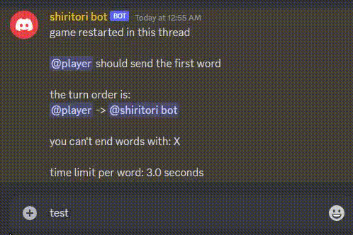

# miscellaneous
this will include a bunch of smaller projects/ assignements.

there is probably more projects that fit here that i didnt include because i forgot about them, and I will add them when i get reminded of them.

## Shiritori Bot

Shiritori is a chinese (japanese?) game where every participant needs to add a new word that starts with the last letter of the previous words without repeating previous words.
This discord bot can create threads that with players (the bot itself can also play) where you play the game.

## Texting app

Very simple and generic texting app. it doesnt save messages between sessions, but it does include different rooms and allow for managers in the chats + commands.

## File Transfer

This project is barely considered enough to be included here. nothing special about it, it just allows to transfer files such as text files or images.

## Board Game

very old and very ugly html site that includes chess, checkers and tic-tac-toe. it functions correctly (besides chess not having en-passent) but controls look bad

